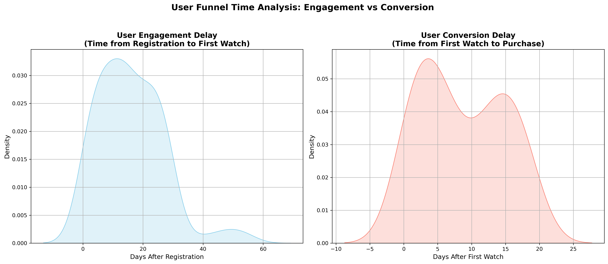

# Project Objective

The objective of this project is to:

Analyze how users move through the funnel (Registration → Engagement → Purchase)

Measure time delays at each stage of the funnel

Calculate conversion rate

Identify user drop‑off points

Generate actionable business insights.

#  Data Source & Database Design (MySQL)

The data is stored in a MySQL relational database and generated using SQL.

Tables Used:

student_info – stores user registration data

student_engagement – stores content watch activity

student_purchases – stores purchase transactions

Synthetic data was created using SQL logic to simulate realistic user behavior.

#  MySQL to Python (Jupyter) Connection

This project demonstrates database connectivity between MySQL and Python using the mysql-connector-python library.

Workflow:

Data stored and processed in MySQL using SQL queries

Python establishes a connection to the MySQL database

SQL query results are loaded directly into a Pandas DataFrame using pd.read_sql()

Further analysis and visualization are performed in Jupyter Notebook

Note: Database credentials are intentionally excluded from this repository for security reasons.

# SQL Logic Used

INNER JOIN to link registered users with engagement data

LEFT JOIN to retain users who never made a purchase

MIN(date) to capture first engagement and first purchase events

DATEDIFF to calculate engagement and conversion delays

GROUP BY and aggregations for user‑level funnel analysis.

# Analysis & Key Metrics

Total users analyzed: 250+

Engagement → Purchase conversion rate: 40%

Metrics calculated:

Days from registration to first watch

Days from first watch to purchase

Python (Pandas) was used for data manipulation and metric calculation.

#  Data Visualization

Visualizations were created using Matplotlib and Seaborn to analyze:

Distribution of time from registration to first engagement

Distribution of time from first engagement to purchase

These visual insights help identify funnel friction and conversion delays.

*Engagement vs Conversion Delay Distribution*

#  Key Insights

Most users engage with content shortly after registration

Conversion after engagement shows higher variability and delay

Only 40% of engaged users convert to purchase, indicating funnel drop‑offs.

#  Business Recommendations

Introduce onboarding nudges within the first 7 days of registration

Trigger reminder emails or offers for users who engage but do not purchase

Segment users based on conversion delay for targeted remarketing.

# Tools & Technologies

SQL (MySQL) database

Python (Pandas, Matplotlib, Seaborn)

Jupyter Notebook

GitHub